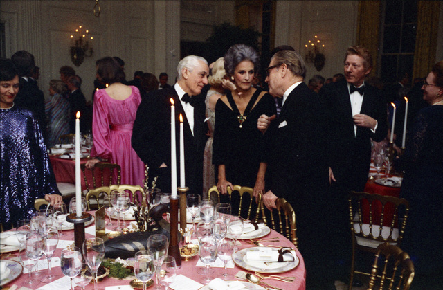
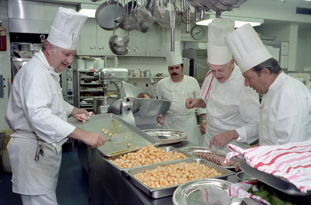

# Kuchnia i jadalnia

Wyobraźcie sobie, że prowadzicie klasyczną restaurację. Niezależnie od rodzaju serwowanego jedzenia (czy jest to klasyczny schabowy, włoski makaron, czy sushi), powinna ona składać się z co najmniej dwóch pomieszczeń: jadalni, gdzie klienci składają zamówienia, a później jedzą wasze pyszne dania. Drugim pomieszczeniem jest kuchnia, gdzie kucharze biegają tam i we wtę przygotowując te posiłki. O ile wasza restauracja nie jest nowoczesnym hipsterskim miejscem, gdzie jedzenie przygotowywane jest na oczach klientów (nie jest, bo nie stać was na bajerne stroje dla kucharzy), *kuchnia* powinna być oddzielona od *jadalni*! W ten sposób klienci będą mogli cieszyć się posiłkami bez ciągłego hałasu brzęczących garnków.

Co nie mniej ważne, takie oddzielenie pozwala na wykorzystanie tej samej kuchni do przygotowywania posiłków na wynos.

**Tak samo powinno być w przypadku waszych przyszłych programów!**

W poprzedniej sekcji dowiedzieliście się o algorytmach, które mają pewne *wejście* (zamówienie klienta) i pewne *wyjście* (danie, które serwujecie po przygotowaniu). Części waszego (lub dowolnego) programu, które są odpowiedzialne za pobieranie tych danych wejściowych i dostarczanie danych wyjściowych, nazywane są **interfejsem użytkownika** (**front-end**). To jest jadalnia.

Z drugiej strony, części programu, które przetwarzają dostarczone dane wewnętrznie i tworzą wynik, który ma być zaprezentowany przez interfejs użytkownika jako wyjście, nazywane są **back-endem** lub **logiką**. Te elementy znajduje się w kuchni.

W zależności od typu programu, część dominujący może być albo back-end albo front-end. W przypadku analizy danych i obliczeń numerycznych, prawdopodobnie powinniście skupić się bardziej na back-endzie. Z drugiej strony, pisząc grę komputerową, front-end może być ważniejszy i bardziej wyrafinowany.

Bardzo często pisanie programu zaczniecie od wersji z bardzo prostym interfejsem tekstowym, a później — po upewnieniu się, że część odpowiedzialna za logikę działa dobrze — stworzycie interfejs graficzny, który będzie łatwiejszy w użyciu dla użytkownika końcowego. W takim przypadku kluczowe jest, abyście od samego początku potrafili jasno oddzielić front-end od back-endu.

<table>
  <thead>
    <tr>
      <th>Jadalnia</th>
      <th>Kuchnia</th>
    </tr>
  </thead>
  <tbody>
    <tr>
      <td></td>
      <td></td>
    </tr>
    <tr>
      <td colspan="2">Źródło zdjęć: <a href="https://nara.getarchive.net/">U.S. National Archives</a></td>
    </tr>
  </tbody>
</table>

Podczas kursu dowiecie się o pisaniu funkcji, modułów i klas, które są świetnymi narzędziami do osiągnięcia wyżej wspomnianej separacji. Musicie jednak myśleć o tym już od samego początku: w pierwszej kolejności po prostu wyróżnijcie wszystkie dane wejściowe w określonym miejscu na początku programu, zaś dane wyjściowe na końcu i wyraźnie oznaczcie te części kodu jako wejście/wyjście.

Opublikowano na licencji [Creative Commons Uznanie autorstwa-Użycie niekomercyjne-Na tych samych warunkach](https://creativecommons.org/licenses/by-nc-sa/4.0/deed.pl).
