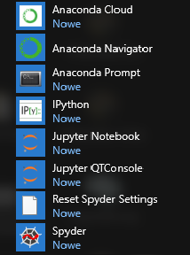

# Instalacja

Jak opisano we wstępie, kompilator Pythona można pobrać i zainstalować bezpośrednio ze strony python.org. Konieczne będzie jednak ręczne zainstalowanie wymaganych bibliotek do obliczeń inżynierskich i naukowych. Dlatego też ten sposób nie jest zalecany. Postępujcie zgodnie z poniższymi instrukcjami, w zależności od systemu operacyjnego:

## Linux

W każdej dystrybucji Linuksa Python jest instalowany domyślnie. Upewnijcie się tylko, że macie zainstalowany odpowiedni pakiet z Pythonem 3 (np. w Ubuntu jest to `python3`). Będziecie także potrzebowali kilku dodatkowych bibliotek: NumPy, SciPy, Matplotlib i Pandas (`python3-numpy`, `python3-scipy`, `python3-matplotlib`, `python3-pandas`).

## Windows

W systemie Windows najprostszym rozwiązaniem jest zainstalowanie środowiska [Anaconda](https://www.anaconda.com/), które zawiera już wszystkie niezbędne biblioteki i zestaw dodatkowych narzędzi. Wejdźcie na stronę <https://www.anaconda.com/download> i pobierzcie instalator.

Po pobraniu instalatora uruchomcie go. Możecie pozostawić domyślne ustawienia. Sugeruję jednak, aby podczas instalacji upewnić się, że opcje **Wszyscy użytkownicy** i **Zarejestruj Anacondę jako systemowy Python 3.11** są zaznaczone.

Po udanej instalacji w menu Start pojawią się nowe pozycje:

Opublikowano na licencji [Creative Commons Uznanie autorstwa-Użycie niekomercyjne-Na tych samych warunkach](https://creativecommons.org/licenses/by-nc-sa/4.0/deed.pl).
