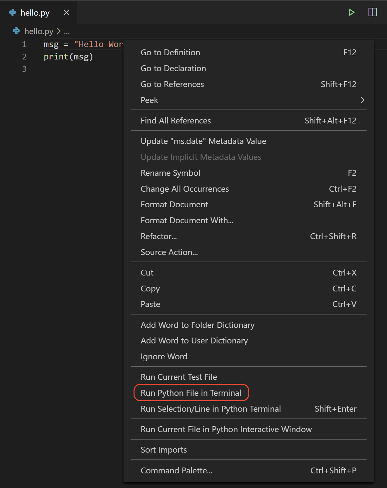

# Środowisko programistyczne

Programy w Pythonie można pisać w Notatniku lub dowolnym edytorze plików tekstowych. Jednak zdecydowanie odradzam to robić. O wiele lepiej jest użyć jakiegoś środowiska programistycznego. Istnieje wiele takich środowisk, których można używać z Pythonem, np. Spyder, PyCharm, Visual Studio, Visual Studio Code...

## VS Code

Jeśli nie macie żadnego ulubionego edytora, polecam darmowy [Visual Studio Code](https://code.visualstudio.com/) (VS Code), który działa w każdym systemie operacyjnym (Windows, Linux, Mac). Można go pobrać ze strony <https://code.visualstudio.com/Download>.

Po zainstalowaniu VS Code, należy zainstalować [Python extension for VS Code](https://marketplace.visualstudio.com/items?itemName=ms-python.python) z Visual Studio Marketplace. Aby uzyskać dodatkowe informacje na temat instalowania rozszerzeń, zobaczcie [Extension Marketplace](https://code.visualstudio.com/docs/editor/extension-marketplace). Rozszerzenie Python nosi nazwę Python i jest publikowane przez firmę Microsoft.

### Uruchomienie VS Code w folderze projektu (obszaru roboczego)

Korzystając z wiersza poleceń lub terminala, utwórzcie pusty folder o nazwie "`hello`", przejdźcie do niego i otwórzcie VS Code (`code`) w tym folderze (`.`), wprowadzając następujące polecenia:

```
mkdir hello
cd hello
code .
```

Uruchamiając VS Code w folderze, folder ten staje się „obszarem roboczym”. VS Code przechowuje ustawienia specyficzne dla tego obszaru roboczego w pliku `.vscode/settings.json`, które są niezależne od ustawień użytkownika przechowywanych globalnie.

Alternatywnie, można uruchomić VS Code poprzez interfejs użytkownika systemu operacyjnego, a następnie użyć **`File` > `Open Folder`**, aby otworzyć folder projektu.

### Wybranie interpretera Pythona

Python jest językiem interpretowanym i aby uruchomić kod Pythona i uzyskać wsparcie w tworzeniu kodu (zwane IntelliSense w VS Code), musicie poinformować VS Code, którego interpretera użyć.

Z poziomu VS Code wybierzcie interpreter Python 3, otwierając **Paletę poleceń** (`Ctrl+Shift+P`), zacznijcie wpisywać polecenie **`Python: Select Interpreter`**, aby wyszukać, a następnie wybrać polecenie. Możecie także użyć opcji **`Select Python Interpreter`** na pasku stanu, jeśli jest dostępna (może ona już pokazywać wybrany interpreter):


Polecenie przedstawia listę dostępnych interpreterów, które VS Code może znaleźć automatycznie. Jeśli nie widzicie żądanego interpretera, przeczytajcie podręcznik VS Code [Konfigurowanie środowisk Pythona](https://code.visualstudio.com/docs/python/environments).

Wybranie interpretera ustawia, który interpreter będzie używany przez rozszerzenie Python dla aktualnego obszaru roboczego.

### Utworzenie pierwszego kodu źródłowego w języku Python

Z panelu Eksploratora wybierzcie przycisk **Nowy plik** w folderze `hello`:


Nazwijcie plik `hello.py`, a otworzy się on automatycznie w edytorze:


Używając rozszerzenia pliku `.py`, informujecie VS Code, że ten plik jest kodem źródłowym Pythona.

> Uwaga:** Pasek narzędzi Eksploratora umożliwia również tworzenie folderów w obszarze roboczym w celu lepszej organizacji kodu.
> Możecie użyć przycisku **Nowy folder**, aby szybko utworzyć folder.

Teraz, gdy macie już plik kodu w swojej przestrzeni roboczej, wprowadźcie następujący tekst w pliku `hello.py`:

```python
msg = "Witaj Świecie!"
print(msg)
```

Gdy zaczniecie wpisywać `print`, zauważcie, jak IntelliSense prezentuje opcje autouzupełniania.


### Uruchomienie programu

Uruchomienie `hello.py` w Pythonie jest bardzo proste. Wystarczy kliknąć przycisk **Run Python File in Terminal** w prawym górnym rogu edytora.

[Używanie przycisku uruchom plik Pythona w terminalu](run-python-file-in-terminal-button.png)

Przycisk otwiera panel terminala, w którym interpreter Pythona jest automatycznie aktywowany, a następnie uruchamia `python3 hello.py` (macOS/Linux) lub `python hello.py` (Windows):


Istnieją trzy inne sposoby uruchamiania kodu Python w VS Code:

* Kliknijcie prawym przyciskiem myszy w dowolnym miejscu okna edytora i wybierz **`Run Python File in Terminal`** (co spowoduje automatyczne zapisanie pliku):

  

* Zaznaczcie jedną lub więcej linii, a następnie naciśnijcie `Shift+Enter` lub kliknij prawym przyciskiem myszy i wybierzcie **`Run Selection/Line in Python Terminal`**. Polecenie to jest wygodne do testowania tylko części pliku.

* Z palety poleceń (`Ctrl+Shift+P`) wybierzcie Python: **`Start REPL`**, aby otworzyć terminal REPL dla aktualnie wybranego interpretera Pythona. W REPL można następnie wprowadzać i uruchamiać linie kodu pojedynczo.


<hr/>

Opublikowano na licencji [Creative Commons Uznanie autorstwa-Użycie niekomercyjne-Na tych samych warunkach](https://creativecommons.org/licenses/by-nc-sa/4.0/deed.pl).  
Source: <https://code.visualstudio.com/docs/python/python-tutorial>
