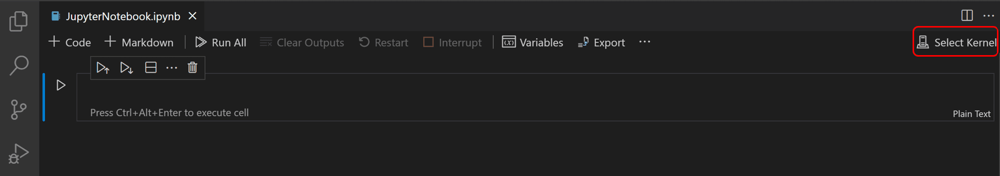
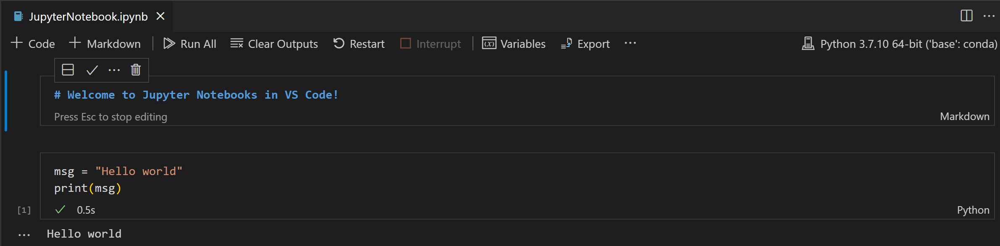
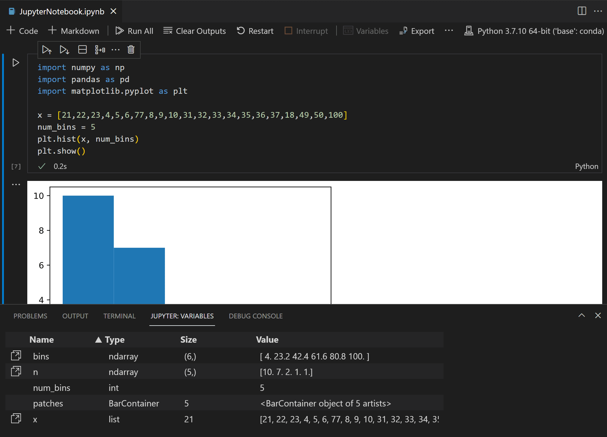

# Szybkie prototypowanie z Jupyter Notebooks

## Czym jest Jupyter?

Jupyter to projekt typu open-source, który pozwala łatwo łączyć tekst [Markdown](https://pl.wikipedia.org/wiki/Markdown) i wykonywalny kod źródłowy Pythona w tak zwanym **notatniku**. Może on zawierać: dane wejściowe i wyjściowe kodu, sformatowany tekst, obrazy, filmy, ładne równania matematyczne itd. Kod komputerowy jest wykonywalny, co oznacza, że można uruchomić fragmenty kodu bezpośrednio w dokumencie i wyświetlić dane wyjściowe tego kodu. Ten interaktywny sposób przetwarzania danych, w połączeniu z narracją multimedialną, pozwala na opowiedzenie ciekawej historii (nawet samemu sobie)!

Program Jupyter można uruchomić za pomocą wiersza poleceń i korzystać z niego w przeglądarce internetowej. Alternatywnie, można bezpośrednio tworzyć, przeglądać i edytować notatniki w VS Code.

## Tworzenie notatnika w VSCode

Notatnik Jupyter możecie utworzyć, uruchamiając **Jupyter: Create Blank New Jupyter Notebook** z palety poleceń (`Ctrl+Shift+P`) lub tworząc nowy plik `.ipynb` w swoim obszarze roboczym.


Następnie wybierzcie jądro za pomocą selektora jądra w prawym górnym rogu.



Jeśli macie już plik notatnika Jupyter (z rozszerzeniem `.ipynb`), możecie go otworzyć, klikając plik prawym przyciskiem myszy i otwierając go za pomocą VS Code lub za pomocą eksploratora plików VS Code.

## Komórki notatnika

Notatnik Jupyter używa *komórek*, czyli bloków, które zawierają fragmenty tekstu i kodu. Każda zawartość tekstowa jest wprowadzana do komórki *Markdown*. Zawiera ona tekst, który można formatować za pomocą prostych znaczników, aby uzyskać nagłówki, pogrubienie, kursywę, wypunktowanie, hiperłącza itd.

Markdown jest bardzo łatwy do opanowania. Sprawdźcie składnię np. na stronie <https://blog.nayma.pl/podstawy-markdown/>. Poniżej zamieszkam kilka najważniejszych wskazówek:

* aby utworzyć tytuł, użyjcie znaku hash na początku linii: `# Tytuł`,
* aby utworzyć nagłówek sekcji, użyjcie dwóch znaków hash: `## Nagłówek sekcji`,
* nagłówki podsekcji i dalszych zagnieżdżeń twórzcie używając trzech, czterech itd. znaków hash (`### Podsekcja`),
* aby zapisać słowo lub frazę *kursywą*, umieśćcie je w gwiazdkach (lub myślnikach): `*italic*` lub `_italic_`,
* aby je **pogrubić**, otoczcie je dwiema gwiazdkami: `**pogrubione**`
* aby utworzyć hiperłącze, użyjcie nawiasów kwadratowych i okrągłych: `[tekst hiperłącza](url)`

Zawartość, która ma zostać wyliczona jest wprowadzana w komórkach kodu. Będziemy używać jądra IPython ("jądro" to nazwa używana dla silnika obliczeniowego), ale powinniście wiedzieć, że Jupyter może być używany z wieloma różnymi językami obliczeniowymi.

Komórka kodu jest oznaczona po lewej stronie następjącym znakiem wejściowym:

`In [ ]:` albo po prostu `[ ]`.

Po dodaniu kodu i wykonaniu go, Jupyter doda numer ID do komórki wejściowej i wygeneruje wynik oznaczony w ten sposób:

`Out [1]:` (w VS Code będzie to po `[1]` obok komórki wejściowej i `...` przy wyjściowej).

### Wykonywanie kodu w komórkach

Gdy macie już Notatnik, możecie uruchomić komórkę kodu za pomocą ikony **Run** po lewej stronie komórki, a dane wyjściowe pojawią się bezpośrednio pod komórką kodu.

Do uruchamiania kodu możecie również użyć skrótów klawiaturowych. W trybie poleceń lub edycji użyjcie kombinacji klawiszy `Ctrl+Enter`, aby uruchomić bieżącą komórkę lub `Shift+Enter`, aby uruchomić bieżącą komórkę i przejść do następnej.


Możecie uruchomić wiele komórek, używając **Run All**, **Run All Above** lub **Run All Below**.

### Tryby komórek kodu

Podczas pracy z komórkami kodu, komórka może znajdować się w trzech stanach: niewybrana, tryb poleceń i tryb edycji. Bieżący stan komórki jest wskazywany przez pionowy pasek po lewej stronie komórki kodu i obramowanie edytora. Gdy pasek nie jest widoczny, komórka jest niezaznaczona.

Gdy komórka jest zaznaczona, może znajdować się w dwóch różnych trybach. Może znajdować się w trybie poleceń lub w trybie edycji. Gdy komórka znajduje się w trybie poleceń, możecie na niej operować i wydawać polecenia klawiaturowe. Tryb ten jest oznaczony pionowym paskiem po lewej stronie komórki.

Gdy komórka znajduje się w trybie edycji, ciągły pionowy pasek jest połączony z obramowaniem wokół edytora komórki. W tym trybie możecie modyfikować zawartość komórki (kod lub Markdown).

Aby przejść z trybu edycji do trybu poleceń, naciśnijcie klawisz `Esc`. Aby przejść z trybu poleceń do trybu edycji, naciśnijcie klawisz `Enter`. Możecie także użyć myszy, aby **zmienić tryb**, klikając pionowy pasek po lewej stronie komórki lub poza obszarem kodu/Markdown w komórce kodu.

### Przełączanie między kodem a Markdown

Edytor Notatnika umożliwia łatwą zmianę typu komórek pomiędzy Markdown a kodem. Kliknięcie selektora języka w prawym dolnym rogu komórki umożliwia przełączanie między Markdown i dowolnym innym językiem obsługiwanym przez wybrane jądro.


Do zmiany typu komórki możecie również użyć klawiatury. Gdy komórka jest zaznaczona i w trybie poleceń, klawisz `M` przełącza typ komórki na Markdown, a klawisz `Y` przełącza typ komórki na kod.

Po ustawieniu Markdown możecie wprowadzić sformatowaną zawartość Markdown do komórki.



Aby wyrenderować komórki Markdown, możecie kliknąć ptaszen na pasku narzędzi komórki lub użyć skrótów klawiaturowych `Ctrl+Enter` i `Shift+Enter`.


## Eksplorator zmiennych i przeglądarka danych

W notatniku Python możliwe jest przeglądanie, sprawdzanie, sortowanie i filtrowanie zmiennych w bieżącej sesji Jupyter. Wybierając ikonę **Variables** na głównym pasku narzędzi po uruchomieniu kodu i komórek, zobaczycie listę bieżących zmiennych, która będzie automatycznie aktualizowana, gdy zmienne będą modyfikowane przez wykonywany kod. Okienko zmiennych zostanie otwarte w dolnej części notatnika.





## Interaktywne obliczenia w notatniku

Możecie przetestować komórkę kodu, pisząc kilka operacji arytmetycznych. Operatory matematyczne dostępne w Pythonie to:

| Operator | Znaczenie                        |
| -------- | -------------------------------- |
| `+`      | dodawanie                        |
| `-`      | odejmowanie                      |
| `*`      | mnożenie                         |
| `/`      | dzielenie                        |
| `**`     | wykładnik (`3**2` oznacza 3²)    |
| `%`      | modulo (reszta z dzielenia)      |
| `//`     | dzielenie podłogowe (bez reszty) |

Utwórzcie nową komórkę kodu Pythona i wpiszcie:

```python
1 + 2
```

Następnie naciśnijcie `Shift+Enter`. Co widzicie? Wypróbujcie inne obliczenia, w tym bardziej złożone, takie jak np.:

```python
2 + 2 * 2
```

lub

```python
9**1/2
```

Jaki jest wynik ostatniej operacji? Dlaczego jest to 4,5? Czy 9 do potęgi ½ nie jest po prostu pierwiastkiem kwadratowym z 9, czyli 3? Porównajcie z tym:

```python
9**(1/2)
```

Widzicie, Python wie jaka jest poprawna [kolejność wykonywania działań matematycznych](https://pl.wikipedia.org/wiki/Kolejno%C5%9B%C4%87_wykonywania_dzia%C5%82a%C5%84).


## Ćwiczenia

Użyjcie notatnika Jupyter (jako kalkulatora), aby rozwiązać następujące dwa problemy:

1. Objętość kuli o promieniu $r$ wynosi $\frac43 \pi r^3$. Jaka jest objętość kuli o średnicy 6,65 cm?
   Jako wartości $\pi$ użyjcie 3.1415926 (na razie).

2. Załóżmy, że cena okładkowa książki wynosi 24,95 EUR, ale księgarnie otrzymują 40% zniżki.
   Koszt wysyłki wynosi 3 EUR za pierwszy egzemplarz i 75 centów za każdy kolejny.
   Jaki jest całkowity koszt hurtowy dla 60 egzemplarzy?


---

Treść udostępniona na licencji [Creative Commons Uznanie autorstwa-Użycie niekomercyjne-Na tych samych warunkach](https://creativecommons.org/licenses/by-nc-sa/4.0/deed.pl).

Opracowano na postawie [wykładu dr Loreeny Barby](https://github.com/engineersCode/EngComp1_offtheground) oraz dokumentacji VS Code <https://code.visualstudio.com/docs/datascience/jupyter-notebooks>.
