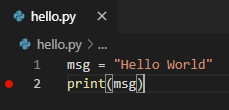

# Debugowanie kodu

Debugger to program komputerowy używany do testowania i debugowania innych programów (w naszym przypadku skryptów Pythona). Głównym zastosowaniem debuggera jest uruchamianie programów docelowych w kontrolowanych warunkach, co pozwala programistom śledzić ich działanie i monitorować zmiany w zasobach komputera, które mogą wskazywać na nieprawidłowe działanie kodu. Typowe funkcje debugowania obejmują możliwość uruchamiania lub zatrzymywania programów w określonych punktach oraz wyświetlanie ich stanu.

Terminy „błąd” oraz „debugowanie” są powszechnie przypisywane admirał Grace Hopper w latach 40. ubiegłego wieku. Podczas pracy nad komputerem Mark II na Uniwersytecie Harvarda, jej współpracownicy odkryli ćmę, która utknęła w przekaźniku, powodując problemy z działaniem systemu. Hopper użyła wtedy terminu „debugging” (debugowanie) w kontekście usuwania tego problemu.


<span style="font-size: 80%">Źródło: U.S. Naval Historical Center Online Library Photograph NH 96566-KN</span>

## Konfiguracja i uruchamianie debuggera w VS Code

Teraz spróbujmy zdebugować nasz prosty program „Hello World”.

Najpierw ustawcie punkt przerwania (*breakpoint*) w linii 2 pliku `hello.py`, umieszczając kursor na wywołaniu `print` i naciskając klawisz `F9`. Alternatywnie, wystarczy kliknąć w lewym marginesie obok numerów linii. Po ustawieniu punktu przerwania, w okienku pojawi się czerwone kółko.



Następnie, aby uruchomić debugger, naciśnijcie klawisz `F5`. Ponieważ jest to pierwsze debugowanie tego pliku, menu konfiguracji zostanie otwarte z palety poleceń, umożliwiając wybór typu konfiguracji debugowania dla otwartego pliku.


Na razie wybierzcie „Python File”, która jest konfiguracją uruchamiającą bieżący plik przy użyciu aktualnie wybranego interpretera Pythona.

Debugger zatrzyma się na pierwszej linii punktu przerwania pliku. Bieżąca linia jest oznaczona żółtą strzałką na lewym marginesie. Jeśli sprawdziszcie okno zmiennych lokalnych (`Local variables`) w tym momencie, zobaczycie zdefiniowaną zmienną `msg`.


Na górze pojawi się pasek narzędzi debugowania z następującymi poleceniami od lewej do prawej: kontynuuj (`F5`), krok (następna linia) (`F10`), wejdź (wchodzi do wnętrza funkcji) (`F11`), wyjdź (opuść bieżącą funkcję) (`Shift+F11`), restart (`Ctrl+Shift+F5`) i zatrzymaj (`Shift+F5`).


Pasek stanu również zmienia kolor (zazwyczaj na pomarańczowy), aby wskazać, że znajdujecie się w trybie debugowania. Konsola debugowania *Python Debug Console* pojawia się również automatycznie w prawym dolnym panelu, aby pokazać wyjście programu oraz wszelkie wywołania i wyniki.

Aby kontynuować uruchamianie programu, wybierzcie przycisk kontynuacji na pasku narzędzi debugowania (`F5`). Debugger uruchomi program do końca.

**Porada:** Informacje debugowania mogą być również dostępne przez najechanie kursorem na kod, na przykład na zmienne. Dla `msg`, najechanie na zmienną wyświetli ciąg `Hello world` w okienku nad zmienną.

Możecie także pracować ze zmiennymi w konsoli debugowania (jeśli jej nie widzicie, wybierzcie **Python Debug Console** w prawym dolnym obszarze VS Code lub wybierz ją z menu **...**). Następnie spróbujcie wprowadzić następujące linie, jedną po drugiej, w wierszu **>** w dolnej części konsoli:

```python
msg
msg.capitalize()
msg.split()
```


Wybierzcie ponownie niebieski przycisk **Continue** na pasku narzędzi (lub naciśnijcie `F5`), aby uruchomić program do końca. W konsoli debugowania Pythona (jeżeli przełączycie się do niej z powrotem) pojawi się napis „Hello World”. Jednocześnie VS Code wyjdzie z trybu debugowania po zakończeniu programu.

Po ponownym uruchomieniu debuggera, zostanie on ponownie zatrzymany na pierwszym punkcie przerwania.

Aby zatrzymać uruchamianie programu przed jego ukończeniem, użyjcie czerwonego kwadratowego przycisku zatrzymania na pasku narzędzi debugowania (`Shift+F5`) lub użyjcie polecenia menu debugowania **`Run` > `Stop`**.

> Korzystajcie regularnie z debuggera, aby zrozumieć, jak działa wasz kod i jakie operacje są wykonywane. Później możecie go użyć do znalezienia błędów w waszych programach. Pamiętajcie, że to normalne, że na początku każdy program ma mnóstwo błędów i jest to normalne. Ważną częścią umiejętności programowania jest umiejętność ich znajdowania i naprawiania.

<hr/>

Opublikowano na licencji [Creative Commons Uznanie autorstwa-Użycie niekomercyjne-Na tych samych warunkach](https://creativecommons.org/licenses/by-nc-sa/4.0/deed.pl).  
Source: <https://code.visualstudio.com/docs/python/python-tutorial>
