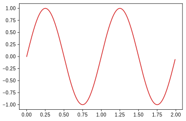
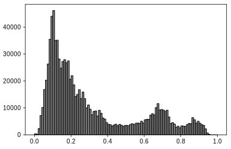

# Matplotlib — eleganckie wykresy

## Wprowadzenie do pakietu Matplotlib na przykładach

Pakiet Matplotlib bazuje na pakiecie numerycznym Numpy i korzysta z obiektów w nim zawartych. Pokażemy, jak z jego pomocą rysować różnorodne wykresy prezentujące graficznie przetwarzane dane i wyniki obliczeń. Zamiast wyliczać zawartość pakietu pokażemy ich użyteczność na przykładach. Zaczniemy od prostych i będziemy po drodze omawiać zastosowane w nich konstrukcje.

## Wykresy funkcji

Prześledźmy działanie poniższego programu:

```python
import matplotlib.pyplot as plt
x = [1, 2, 3]
y = [4, 6, 5]
plt.plot(x, y)
plt.show()
```

Rezultatem jest wykres:


Co dokładnie się tutaj dzieje?

Aby skorzystać z pakietu graficznego Matplotlib importujemy go do naszego programu poleceniem `import`.

> Pod-pakiet `pyplot` jest jednym z paru nieco różnych _interfejsów_ do Matplotlib - tj. sposobów wykorzystania jego funkcjonalności. Inny, też często wykorzystywany, nazywa się `pylab` i można go importować wprost ( `import pylab`). Pyplot zapewnie nieco większą elastyczność, chociaż dla najprostszych przykładów - takich, jakie tu omówimy - nie ma istotnej różnicy.

Wytwarzamy dwie listy `x` i `y` zawierające ciągi liczb 1, 2, 3 oraz 4, 6, 5.

Funkcja `plot` rysuje wykres i umieszcza na nim punkty o współrzędnych zawartych w listach przekazanych jej jako argumenty. Pierwszy argument zawiera współrzędne _x_-owe kolejnych punktów, a drugi argument współrzędne _y_-owe kolejnych punktów wykresu. Ponieważ listy mają po trzy elementy, tak więc wykres zawierać będzie trzy punkty o współrzędnych (1, 4), (2, 6) oraz (3, 5). Domyślnie punkty na wykresie łączone są ze sobą niebieską linią ciągłą. To oczywiście można zmienić - dodając opcjonalne parametry do wywołania `plot` można uzyskać linię o innym kolorze, linię przerywaną, z kropek, albo w ogóle brak linii - a za to np. duże kropki (trójkąty, gwiazdki, ...) w miejscach odpowiadających punktom danych.

Po wywołaniu funkcji `plot` wykres nie pokazuje się jeszcze na ekranie. Aby go pokazać, używamy funkcji `show`. Wykres pojawia się na ekranie w osobnym oknie, a Python czeka z wykonywaniem kolejnych instrukcji do momentu zamknięcia okna z wykresem.

W okienku wykresu mamy kilka guzików (po lewej stronie na dole). Służą one do manipulowania wyglądem rysunku. Guzikiem z krzyżykiem możemy zmniejszać/zwiększać skalę na osiach (wciskając prawy guzik myszy i przesuwając kursor po obrazku) oraz przesuwać cały wykres (wciskając lewy guzik myszy i przesuwając kursor po obrazku). Guzik z okienkiem i strzałkami pozwala także zmieniać rozmiar i położenie osi wykresu wewnątrz okna wybierając właściwe wartości. Guzik z domkiem przywraca wyjściowe ustawienia rysunku. Guzik z obrazkiem dyskietki (czy ktoś jeszcze wie, co to takiego?) pozwala zachować wykres (jego aktualny stan, czyli z uwzględnieniem dokonanych interaktywnie modyfikacji) jako plik graficzny jednego z kilku formatów.

Narysujmy wykres funkcji sinus

```python
import numpy as np
import matplotlib.pyplot as plt
x = np.arange(0.0,  2.0,  0.01)
y = np.sin(2. * np.pi * x)
plt.plot(x, y)
plt.show()
```



Oprócz funkcji z pakietu Matplotlib odwołujemy się tu również wprost do funkcji z pakietu NumPy.

Funkcja `arange` jest podobna do standardowej funkcji `range` wytwarzającej określone sekwencje liczb w postaci listy. Funkcja `arange` zamiast listy wytwarza tablicę zawierającą ciąg liczb zmiennoprzecinkowych zaczynający się od pierwszego podanego argumentu funkcji `arange` (u nas `0.0`), a kończący się przed drugim argumentem (tradycyjnie, ciąg wynikowy nie zawiera wartości podanej jako drugi argument, u nas `2.0`). Różnica między elementami wytworzonego ciągu domyślnie wynosi 1, ale jeśli podamy funkcji `arange` trzeci argument, to definiuje on nową różnicę ciągu, u nas wynosi on `0.01`.

Tak więc zmienna `x` jest tablicą-wektorem zawierającą ciąg liczb od 0 do 1,99 co 0,01 (czyli 0, 0,01, 0,02, ..., 1,98, 1,99).

Funkcja `sin` służy do obliczania wartości funkcji sinus dla argumentu podanego w radianach. A co u nas jest argumentem tej funkcji? Wyrażenie będące argumentem zawiera mnożenie liczby `2.0` przez `pi` (pochodzące z pakietu NumPy), a następnie mnożenie wyniku przez tablicę `x`. Zmienna `pi` zawiera przybliżoną wartość matematycznej stałej π ≈ 3,1415926... Mnożenie liczby i tablicy, jak wiemy z poprzedniego punktu, daje w wyniku tablicę. Oznacza to, że argumentem funkcji `sin` jest nie liczba, ale tablica! Taka możliwość jest przewidziana przez twórców pakietu Numpy; wynikiem wywołania funkcji jest wtedy również tablica. Jest ona tej samej długości co tablica będąca argumentem wywołania funkcji.

Zatem zmienna `y` zawiera ciąg wartości funkcji sinus policzonych dla wartości zawartych w zmiennej `x` pomnożonych każda przez 2π (czyli sin(2π·0), sin(2π·0,01), sin(2π·0,02), ..., sin(2π·1,98), sin(2π·1,99)).

Funkcja `plot(x,y)` narysuje zestaw punktów o współrzędnych (0, sin(2π·0)), (0,01, sin(2π·0,01)), (0,02, sin(2π·0,02)), ..., (1,98, sin(2π·1,98)), (1,99, sin(2π·1,99)) połączonych niebieską linią.

Ulepszmy ten wykres:

```python
import numpy as np
import matplotlib.pyplot as plt

x = np.arange(0.0, 2.0, 0.01)
y = np.sin(2. * np.pi * x)
plt.plot(x, y, 'g:', linewidth=6)

plt.xlabel('Czas [s]')
plt.ylabel('Pozycja [cm]')
plt.title('Nasz pierwszy wykres')
plt.grid(True)
plt.show()
```


W porównaniu z poprzednim przykładem pojawiło się na wykresie kilka drobnych zmian i „ozdobników”.

W funkcji `plot` pojawiły się dwa nowe parametry:

1. `'g:'` — ten parametr steruje wyglądem rysowanej linii wykresu. Pierwsza litera tego napisu określa kolor linii (na przykład `r`: czerwony, `b`: niebieski, `g`: zielony, `y`: żółty, `k`: czarny). Drugi znak napisu określa wygląd samej linii (np. `-`: ciągła, `:`: kropkowana, `o`: okrągłe punkty bez linii, `+`: krzyżyki bez linii, itd.).
2. `linewidth=6` — ten parametr zmienia grubość rysowanej linii.

Dodaliśmy też wywołania funkcji `xlabel` i `ylabel`. Ich argumentami są napisy, które pojawią się jako opisy osi, odpowiednio poziomej i pionowej. Wywołanie funkcji `title` wypisuje przekazany jej napis jako tytuł całego wykresu.

Funkcja `grid` dorysowuje siatkę prostokątną na wykresie w wybranych punktach opisujących wartości na osiach wykresu. Punkty, w których wybierane są wartości opisane na osiach (ang. _tick_) są wybierane automatycznie (oczywiście jeśli chcemy, możemy zmieniać ich położenie i opisy odpowiednią funkcją, powiemy o tym później).

### Kilka wykresów we wspólnych osiach - pierwsza wersja

```python
import numpy as np
import matplotlib.pyplot as plt

x = np.arange(0.0, 2.0, 0.01)
y1 = np.sin(2. * np.pi * x)
y2 = np.cos(2. * np.pi * x)
plt.plot(x, y1 , 'g:', x , y2 , 'r')
plt.legend((r'wartość $\sin(t)$' , r'$\cos(t)$'))
plt.xlabel('Czas [s]')
plt.ylabel('Pozycja [cm]')
plt.title('Wykres')
plt.grid(True)
plt.show()
```


W jednym układzie współrzędnych możemy narysować wiele wykresów. Robimy to podając w jednym poleceniu `plot` kolejno zestawy parametrów opisujące poszczególne linie: współrzędne x, współrzędne y, sposób wykreślania linii. Aby łatwo identyfikować linie można dodać legendę poleceniem `legend()`. Sposób kontrolowania wyglądu i położenia legendy: `help(plt.legend)` (oczywiście po zaimportowaniu modułu: `import matplotlib.pyplot as plt` ).

### Kilka wykresów we wspólnych osiach - wersja druga

```python
import numpy as np
import matplotlib.pyplot as plt

x = np.arange(0.0,  2.0,  0.01)
y1 = np.sin(2. * np.pi * x)
y2 = np.cos(2. * np.pi * x)
y = y1 * y2
l1,  = plt.plot(x, y, 'b')
l2, l3 = plt.plot(x, y1, 'r:', x, y2, 'g')
plt.legend((l2, l3, l1), (r'$\sin(t)$' , r'$\cos(t)$', r'$y_1 \times y_2$'))
plt.xlabel(r'Faza $\phi$')
plt.ylabel('Pozycja')
plt.title('Wykres')
plt.grid(True)
plt.show()
```


Wykresy możemy dodawać do współrzędnych kolejnymi poleceniami `plot`. Funkcja `plot` zwraca listę linii. Notacja `l1, = plt.plot(x, y, 'b')` wydobywa z listy pierwszą linię (Gdyby po `l1` nie było przecinka to `l1` byłoby listą zawierającą jeden obiekt klasy linia ).

Dzięki nazwaniu poszczególnych obiektów linii możemy kontrolować ich kolejność (i obecność) na legendzie.


## Histogram (diagram liczebności)

```python
import matplotlib.pyplot as plt

zliczenia = [0, 1, 2, 2, 3, 3, 3, 3, 3, 3, 4, 4, 4, 5, 7]
plt.hist(counts, facecolor='#2ab0ff', edgecolor='#169acf')
plt.show()
```


Do zmiennej `zliczenia` przypisujemy sekwencję z ręcznie podanymi wartościami. Zakres zmienności badanych zliczeń (odkładany na osi _X_) zostanie podzielony na przedziały (ang. _bin_) o jednakowej „szerokości”; domyślnie będzie ich 10. Funkcja `hist()` zlicza wystąpienia wartości w binach i rysuje histogram. Funkcja ta zwraca krotkę (array ze zliczeniami, array z binami, lista zawierająca prostokąty, które histogram rysuje, tzw. obiekty Patch).

Porządek wartości, których histogram zostanie stworzony nie ma znaczenia. Mogą one oczywiście być umieszczone również w tablicy NumPy.

### Przykład bardziej zaawansowany

Wyjaśnienie działania znajduje się w komentarzach do programu:

```python
import numpy as np
import matplotlib.pyplot as plt

from scipy.stats import norm
# scipy to pakiet zawierający wiele modułów do obliczeń naukowych
# scipy.stats to moduł zawierający funkcje statystyczne
# wykorzystamy go do generowania danych z rozkładem normalnym

mi, sigma = 100, 15
x = mi + sigma * np.random.randn(10000)
# numpy.random.randn zwraca array z liczbami pseudolosowymi
# pochodzącymi z rozkładu normalnego o średniej 0 i wariancji 1
# przemnożenie przez odchylenie standandardowe sigma i dodanie śreniej mi
# transformuje rozkład do rozkładu normalnego o średniej mi i wariancji sigma**2


n, bins, patches = plt.hist(x, 50, density=True, facecolor='deepskyblue', edgecolor='b', alpha=0.75)
# Tu w jawny sposób odbieramy zwracane przez plt.hist obiekty
# Zmieniamy też:
#   - ilość binów na 50
#   - normujemy histogram do jedności
#   - ustalamy kolor prostokątów na zielony
#   - ustawiamy (nie)przezroczystość prostokątów na 0.75

bincenters = 0.5 * (bins[1:] + bins[:-1])
# wytwarzamy array z centrami binów korzystając z granic binów
# zwróconych przez plt.hist w macierzy bins

y = norm.pdf(bincenters, mu, sigma)
# obliczamy wartości w normalnym rozkładzie gęstości prawdopodobieństwa
# o średniej mi i wariancji sigma**2 dla wartości bincenters

l = plt.plot(bincenters, y, 'r--', linewidth=1)
# do histogramu dorysowujemy linię

plt.show()
```


## Krzywa parametryczna

Rysowanie krzywej danej w postaci parametrycznej niewiele się różni od rysowania wykresu funkcji. Żeby było zabawniej, wykonam jeszcze przy okazji rachunek Monte Carlo oraz jego wizualizację.

Krzywa, jaką tutaj narysujemy to tzw. [lemniskata Gerona](https://pl.wikipedia.org/wiki/Lemniskata_Gerona). Zostanie dodatkowo opisana okręgiem jednostkowym; następnie, wylosuję dużą liczbę punktów o równomiernym rozkładzie leżących w kwadracie opisanym na tym okręgu. Robię tak, ponieważ łatwo mi jest wylosować tablicę wielu liczb z zakresu (0, 1) — jest do tego gotowa funkcja `numpy.random.random`, następnie przeskalować i przesunąć je do odcinka (-1, 1). Wreszcie, traktując je jako pary współrzędnych `(x, y)`, pozostawiam tylko te, które znalazły się we wnętrzu koła jednostkowego (odrzucając pozostałe), i dzielę na te, które znalazły się w obszarze wewnątrz lemniskaty, i te, które znalazły się na zewnątrz.

Intuicyjnie jest dość jasne, że — o ile losowaliśmy punkty rzeczywiście w sposób równomierny — stosunek liczby „trafień" w obszar ograniczony lemniskatą do liczby wszystkich „trafień" w obszar koła będzie w przybliżeniu równy stosunkowi pól powierzchni tych obszarów. I na tym tu poprzestaniemy; to, jak dokładne to może być przybliżenie, czyli jakiej wielkości błędu możemy oczekiwać, to już problem na inne zajęcia...

```python
import numpy as np
import matplotlib.pyplot as plt

plt.axes(aspect='equal') # to mi gwarantuje, że okrąg nie wyjdzie „spłaszczony"

Φ = np.arange(0, 2*np.pi, 2*np.pi/600)
X = np.cos(Φ)
Y = np.sin(2*Φ) / 2 # = np.sin(Φ) * np.cos(Φ)
plt.plot(X, Y, 'b')
YO = np.sin(Φ)
plt.plot(X, YO, 'k')

# biorę całą masę losowych punktów z przedziału (-1, 1)
P = np.random.random((100000, 2)) * 2 - 1 # milion par (x, y)
# wyrzucam te, które są poza kołem x**2 + y**2 < 1
P = P[(P**2).sum(axis=1) < 1]
# dzielę na te co wewnątrz lemniskaty, i te co na zewnątrz
I_in = np.abs(P[:,1]) < np.abs(P[:,0]) * np.sqrt(1 - P[:,0]**2)
P_in = P[I_in]
P_out = P[~I_in]

# maluję wewnętrzne na niebiesko
plt.plot(P_in[:,0], P_in[:,1], 'b,')
# a zewnętrzne na żółto
plt.plot(P_out[:,0], P_out[:,1], 'y,')

# powierzchnia to z grubsza stosunek liczby punktów wewnętrznych do wszystkich
S = P_in.size / P.size
plt.title('Pole pow. wnętrza lemniskaty to ok. {:.3f} pola pow. koła'.format(S))

plt.show()
```

Przy okazji, jak widać w kodzie Pythona (wersja 3) można bezproblemowo używać liter z innych alfabetów, nie tylko łacińskiego. Niestety nie wszystkie systemy operacyjne zapewniają bezproblemową obsługę pełnego zestawu liter wszelkich języków, dlatego na ogół wykorzystywanie liter z egzotycznych systemów pisma nie jest szczególnie zalecane.

W wyniku uruchomienia tego programu powinno pojawić się okno z obrazkiem podobnym do poniższego:


## Wizualizacja zawartości tablicy dwuwymiarowej

```python
import numpy as np
import matplotlib.pyplot as plt

axis = np.linspace(-1., 1., 21)
X , Y = np.meshgrid(axis, axis)
Z = np.sin(np.pi * X) + np.cos(np.pi * Y)
plt.contourf(axis, axis, Z)
plt.colorbar()
plt.show()
```


Funkcja `meshgrid(oś_x, oś_y)` tworzy tablice 2D ze współrzędnymi _x_ i _y_ z dwóch sekwencji. Następnie można je połączyć z dowolnym wyrażeniem matematycznym. Funkcja `contourf(oś_x, oś_y, wartości)` tworzy wypełniony wykres konturowy. Jej argumentami powinny być osie _x_ oraz _y_ (jednowymiarowe tablice) oraz dwuwymiarowa tablica wartości. Wywołanie funkcji `colorbar()` zapewnia pasek wizualizujący zależność pomiędzy kolorami a wartościami liczbowymi.

Kolory wykresu można zmieniać za pomocą parametru `cmap` funkcji `countourf(...)`, który odpowiada za mapowanie między wartościami elementów tablicy a kolorami. Istnieje wiele predefiniowanych takich mapowań (colormaps), opisanych w [dokumentacji](https://matplotlib.org/3.1.1/gallery/color/colormap_reference.html).

```python
# this is a continuation of the previous example
plt.contourf(axis, axis, Z, cmap='hot')
plt.colorbar()
plt.show()
```


## Plik graficzny jako źródło danych

## Graphic file as data source

Możecie użyć pliku graficznego jako źródła danych (pobierzcie przykładowe zdjęcie [tutaj](photo.jpg)):


```python
import matplotlib.pyplot as plt

img = plt.imread('photo.jpg')
plt.imshow(img)
plt.show()
```


Wynikiem wywołania `imread` jest tablica o kształcie (_wysokość_, _szerokość_, 3) zawierająca dla każdego piksela obrazu wartości jego składowych RGB, tj. natężeń barw: czerwonej, zielonej, i niebieskiej - jako liczby w zakresie od 0 do 255 włącznie. Oczywiście na tej tablicy możemy wykonywać najróżniejsze operacje, analizując treść obrazu czy przekształcając go. Przykładowo:

```python
# kontynuacja poprzedniego przykładu
img1 = img[400:450, 750:800]  # przycinam obraz do kształtu 50x50 pikseli
img2 = img1.sum(axis=2)  # sumuję według ostatniej osi (tj. dodaję wartości R+G+B)
plt.imshow(img2, cmap='bone', interpolation='bicubic')
plt.show()
```


Możemy wykreślić histogram opisujący rozkład intensywności pikseli obrazu:

```python
# kontynuacja
img3 = img.sum(axis=2)
img4 = img3 / img3.max()   # normalizuję wartości do zakresu [0, 1]

plt.hist(img4.flatten(), bins=100, facecolor='gray', edgecolor='k')
plt.show()

```



---

Treść udostępniona na licencji [Creative Commons Uznanie autorstwa-Użycie niekomercyjne-Na tych samych warunkach](https://creativecommons.org/licenses/by-nc-sa/4.0/deed.pl).  

Oryginalny autor Robert J. Budzyński. Źródło: [https://brain.fuw.edu.pl/edu/index.php/PPy3/Matplotlib](https://brain.fuw.edu.pl/edu/index.php/PPy3/Matplotlib).
